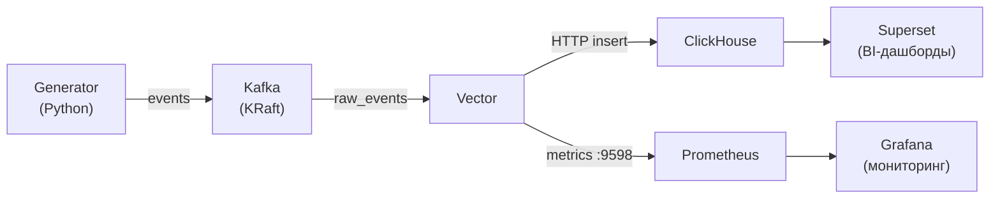
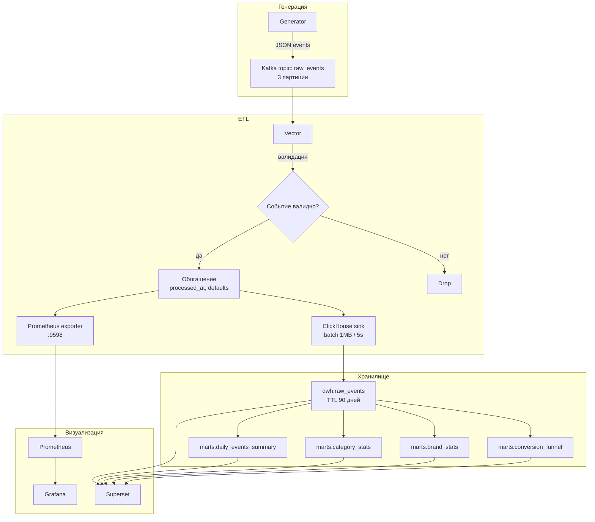
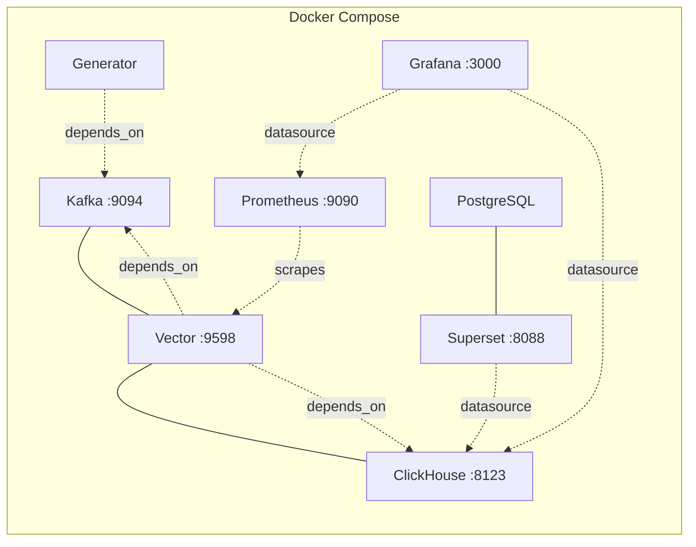

# Website Analytics Pipeline

Система генерации, хранения и мониторинга для интернет-магазина одежды. Генерирует поток пользовательских событий, собирает и обрабатывает их через Kafka и Vector, хранит в ClickHouse и визуализирует через Grafana и Apache Superset.

# ToDo

Добавить Apache Airflow для возможности создания ETL-пайплайнов DWH -> Data Marts

## Архитектура

### Общая схема



### Поток данных



### Инфраструктура (Docker Compose)



### Компоненты

| Сервис | Технология | Назначение |
|--------|-----------|------------|
| **Generator** | Python 3.12, confluent-kafka, faker | Генерация реалистичного потока событий (~500 пользователей) |
| **Kafka** | Apache Kafka 3.7 (KRaft) | Очередь сообщений (топик `raw_events`, 3 партиции) |
| **Vector** | Vector 0.41.1 | ETL-пайплайн: валидация, обогащение, маршрутизация |
| **ClickHouse** | ClickHouse 24.3 | Колоночная OLAP-база для аналитики |
| **Prometheus** | Prometheus 2.51.0 | Сбор метрик пайплайна |
| **Grafana** | Grafana 11.0.0 | Мониторинг (дашборд Vector Pipeline) |
| **Superset** | Apache Superset 3.1.1 | BI-дашборды и ad-hoc аналитика |
| **PostgreSQL** | PostgreSQL 16 | Метаданные Superset |

## Структура проекта

```
website_service/
├── docker-compose.yml        # Докер компос
├── .env.example              # Шаблон переменных окружения
│
├── generator/                # Генератор событий
│   ├── Dockerfile
│   ├── generator.py          # Основной скрипт генерации
│   ├── products_db.json      # База товаров (25 позиций, 5 категорий)
│   └── requirements.txt
│
├── vector/                   # Конфигурация Vector
│   └── vector.yaml
│
├── storage/                  # Схема хранилища Clickhouse
│   └── init.sql              # DDL: raw-слой + аналитические витрины
│
├── prometheus/               # Конфиг Prometheus
│   └── prometheus.yml
│
├── grafana/                  # Grafana  
│   ├── provisioning/
│   │   └── datasources/
│   │       └── datasources.yml
│   └── dashboards/
│       └── vector-pipeline.json
│
└── superset/                 # Конфиг Superset 
    ├── superset_config.py
    └── superset-init.sh
```

## Быстрый старт

### Требования

- [Docker](https://docs.docker.com/get-docker/)
- [Docker Compose](https://docs.docker.com/compose/install/)

### Запуск

1. **Клонировать репозиторий:**

```bash
git clone <url-репозитория>
cd website_service
```

2. **Создать файл `.env`:**

```bash
cp .env.example .env
```

3. **Запустить все сервисы:**

```bash
docker compose up -d
```

### Доступ к интерфейсам

| Интерфейс | URL | Логин / Пароль |
|-----------|-----|----------------|
| Grafana | http://localhost:3000 | admin / admin |
| Superset | http://localhost:8088 | admin / admin |
| Prometheus | http://localhost:9090 | — |
| ClickHouse (HTTP) | http://localhost:8123 | — |

### Подключение к Superset

В Settings -> Database Connections добавить новое подключение с типом Other (Другое) и вставить, к примеру clickhousedb://default@clickhouse:8123/dwh

## Конфигурация

### Сценарии генерации

Задается переменной `SCENARIO` в `.env`:

| Сценарий | Описание |
|----------|----------|
| `normal` | Обычный трафик с дневными пиками (12:00, 20:00) |
| `peak` | Распродажа — повышенная нагрузка |
| `anomaly` | Аномальные паттерны |

### Типы событий

| Событие | Вес | Описание |
|---------|-----|----------|
| `page_view` | 40% | Просмотр страницы |
| `product_view` | 30% | Просмотр товара |
| `add_to_cart` | 12% | Добавление в корзину |
| `add_to_wishlist` | 8% | Добавление в избранное |
| `checkout` | 5% | Оформление заказа |
| `remove_from_cart` | 3% | Удаление из корзины |
| `search` | 2% | Поиск по каталогу |

## Хранилище данных

### Слой сырых данных (`dwh`)

Таблица `dwh.raw_events` — все входящие события с TTL 90 дней и партиционированием по дате.

### Аналитические витрины (`marts`)

Реализованы как **материализованные представления**, обновляются автоматически. По факту как таковыми витринами не являются, потому что витрины были бы копиями таблицы из DWH, поэтому реализовал как заранее посчитанные метрики:

| Витрина | Описание |
|---------|----------|
| `marts.daily_events_summary` | Почасовая агрегация событий по типу и устройству |
| `marts.category_stats` | Дневная статистика по категориям товаров |
| `marts.brand_stats` | Дневная статистика по брендам |
| `marts.conversion_funnel` | Почасовая воронка конверсии |

## Мониторинг

### Grafana

Предустановленный дашборд **Vector Pipeline Monitoring** отслеживает:
- Скорость приема/отправки событий
- Ошибки обработки
- Consumer lag Kafka

### Prometheus

Метрики Vector доступны на порту `9598`. Prometheus скрейпит их с интервалом 15 секунд.

## Управление

```bash
# Добавление второго генератора при необходимости
docker compose up -d --scale generator=2
```

## Порты

| Порт | Сервис |
|------|--------|
| 3000 | Grafana |
| 8088 | Superset |
| 8123 | ClickHouse HTTP |
| 9090 | Prometheus |
| 9094 | Kafka (внешний доступ) |
| 9598 | Vector (метрики) |

## Безопасность

> Проект настроен для локальной разработки
